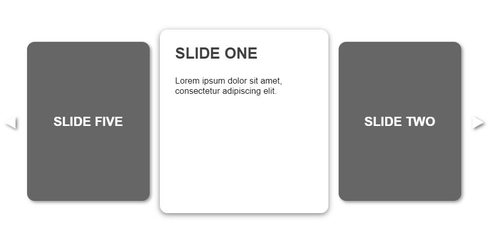
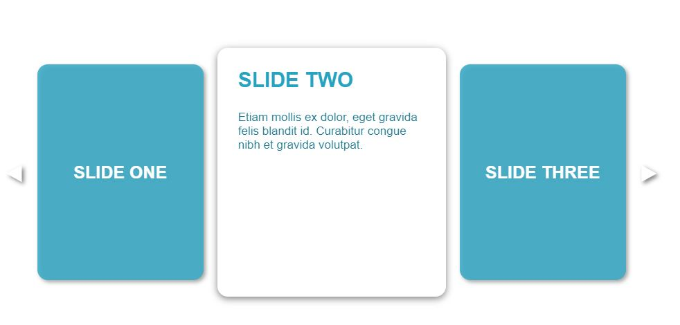

# React Three Panel Carousel

Simple three panel carousel for information sets.
Title is previewed on left and right panels, full display shown on middle card.

### Preview



## Features

- Collapses to one panel at medium devices

## Getting started

```
npm i react-3-carousel
```

### Example

```js
import Carousel from "react-3-carousel";

export default class InformationSet extends Component {
  render() {
    return (
      <Carousel
        titles={[
          "SLIDE ONE",
          "SLIDE TWO",
          "SLIDE THREE",
          "SLIDE FOUR",
          "SLIDE FIVE",
        ]}
        descriptions={[
          "Lorem ipsum dolor sit amet, consectetur adipiscing elit.",
          " Etiam mollis ex dolor, eget gravida felis blandit id. Curabitur congue nibh et gravida volutpat.",
          "Integer tincidunt lorem non lacus laoreet, sed porta dui porttitor. ",
          "Vestibulum suscipit vel dolor sit amet bibendum.",
          "Nam ipsum enim, rutrum nec lectus eu, imperdiet dictum quam. ",
        ]}
      ></Carousel>
    );
  }
}
```

# Props

- `titles`: array of titles
- `descriptions`: array of descriptions

# Basic CSS Changes

- to find the full CSS file, go to the repository/src/carousel.css
- to override, can make your respective CSS file edits and add !important
- eg. to change background colour:

```
.image-slide-left .card,
.image-slide-right .card {
  background-color: #0e97b9e5 !important;
}

.image-slide-center .card {
  background-color: white !important;
}
```



- to change font styles:

```
.image-slide-left .card h1,
.image-slide-right .card h1

.image-slide-center h1,
.card p
```
